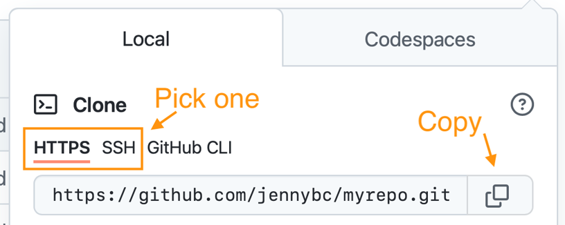
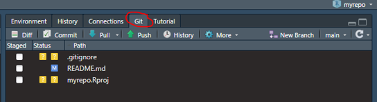
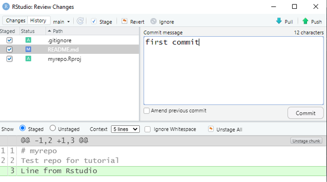
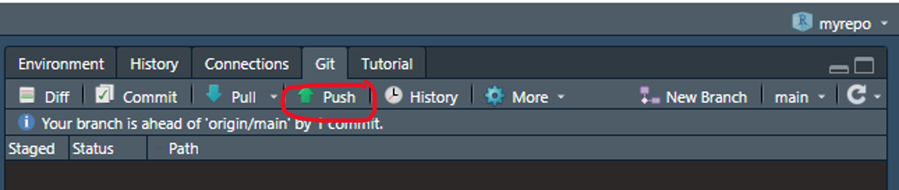
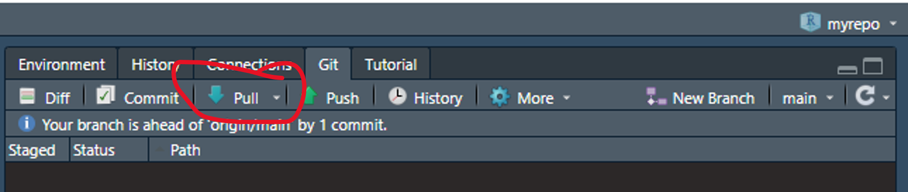
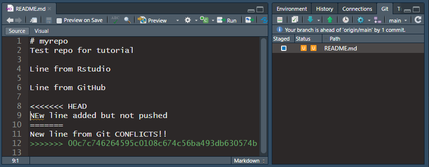

#  Prerequisites:  

+ R and Rstudio installed (available from Software Centre) 
  + Software Centre can be very slow to install, you can install R and RStudio without administrator permissions from the internet as well https://posit.co/download/rstudio-desktop/
+ Install Git https://gitforwindows.org/ (does not require admin permissions)
  + NOTE: When asked about “Adjusting your PATH environment”, make sure to select “Git from the command line and also from 3rd-party software”. Otherwise, accept the defaults.
+ Create a GitHub account https://github.com/

<!-- --- -->
#  Start up 

+ Install R packages
	+ `install.packages(" usethis ")`

<!-- --- -->
#  Set username and email for git 

+ `usethis::use_git_config(user.name = "Jane Doe", user.email = "jane@example.org")`
  + `user.name` is the name associated with your git commits so just make it informative for your collaborators (ie: actual name, github username)
  + `user.email` must match your GitHub account email

<!-- --- -->
#  Let git talk to GitHub  

+ `usethis::create_github_token()`
  + select “repo”, “user”, and “workflow” scopes
+ `gitcreds::gitcreds_set()`

<!-- --- -->
#  Start a new project with GitHub 

**Step 1**: Make a new repo on GitHub
+ Go to https://github.com and make sure you are logged in.
+ Near “Repositories”, click the big green “New” button.

+ How to fill this in:
  + Repository template: No template.
	+ Repository name: myrepo . Like a variable name, in code: descriptive but brief, no whitespace. Letters, digits, - , . , or _ are allowed.
	+ Description: any short description of the project
	+ Public.
	+ Initialize this repository with: Add a README file.
	+ Click the big green button that says “Create repository”.

<!-- --- -->
#  Start a new project with GitHub 

**Step 2**: Copy repo URL
+ Now click the big green button that says “<> Code”.
+ Copy a clone URL to your clipboard. Use the HTTPS URL.

<!-- --- -->
#  Start a new project with GitHub 

+ **Step 3**: Clone into a new project in RStudio
+ File > New Project > Version Control > Git. In the “repository URL” paste the URL of your new GitHub repository.
	+ Be intentional about where you create this Project.
	+ I suggest you “Open in new session”.
+ Click “Create Project” to create a new directory,
+ This should download the README.md file that we created on GitHub in the previous step. Look in RStudio’s file browser pane for the README.md file.
+ Behind the scenes, RStudio has done this for you:
 `git clone https://github.com/see24/myrepo.git`

<!-- --- -->
#  Work on a project  

.pull-left[
+ Edit the README.md file, e.g., by adding the line “This is a line from RStudio”.
+ Save the file locally
+ On the Git pane click commit
+ In the pop-up review the changes at the bottom
+ Check the “Staged” box and type a commit message and click “Commit”
]

.pull-right[

]

<!-- --- -->
#  Sync changes to GitHub: Push 
.pull-left[
+ Click “Push” in the Rstudio Git pane
+ Look at the repo on GitHub so see the new line is there
]
.pull-right[]

<!-- --- -->
#  Sync local copy from GitHub: Pull 

.pull-left[
+ In the GitHub repo main page
+ In the upper right corner of the Readme, click on the pencil
+ Add a line eg : “Line added from GitHub.”
+ Click “Commit changes.”
+ In RStudio click Pull on the Git pane
+ You should see the new line in the Readme
]

.pull-right[]

<!-- --- -->
#  Add an existing project to GitHub 

+ Create a new repo and Rstudio project in the same way as above
+ Simply copy all files into the newly created folder on your local computer
+ Stage and commit all files that you **want to store on GitHub**
	+ Nothing sensitive ie passwords, keys etc ( you can have a private repo if you are not ready to share code with the world)
	+ Probably not large datasets
	+ Use . gitignore to avoid git tracking things (more on this later)  
		
		
*This is the simplest way to do it but there is more advance, more traditional git way to do it: https://happygitwithr.com/existing-github-last.html*

<!-- --- -->
#  Git Terminology 1 

+ Repository (repo): Folder that contains a hidden .git file that tracks changes made to files in that folder. The folder can “live” on your local computer or a server like GitHub’s. On GitHub the repository is also the web page where all the files are stored among other things
+ Push: Copy changes from your local version of the repo to the GitHub version
+ Pull: Copy changes from the GitHub version of the repo to you local version
+ Clone: make a copy of a git repository.  By default in R studio this is connected to the GitHub version (called the remote or origin)
+ Commit: A marker that is kept in the git history and helps to incrementally track changes. Made useful by descriptive commit messages

<!-- --- -->
#  When to commit 

+ Often!
+ But not too often!
    + Use “Amend previous commit” checkbox when you want to make sure to commit but aren’t sure you are done yet
+ Try to make each commit distinct and accomplish one thing
	+ `Make data cleaning script`
	+ `Create exploratory plots`
	+ `Fix bug in data cleaning handling of dates`
	+ `Update exploratory plots with dates`

<!-- --- -->
# What to commit
+ Everything! 
  + Git can track any file but it does a better job with raw text files (eg: .R, .Rmd, .html, .md, .py, .sh, .txt)
  + For files like word docs or pdfs it can't track the content and tracks to whole file every time you make a change
+ Except!:
	+ Nothing sensitive ie passwords, keys etc (you can have a private repo if you are not ready to share code with the world but still)
	+ Probably not large datasets. I just keep these locally but would be better to have them on a shared drive and download them programmatically 
+ .gitignore: a file at the top level of git repo that tells git what not to track. 
  + Uses regular expressions to match file or folder names or types.
  + Example file: https://github.com/LandSciTech/caribouMetrics/blob/master/.gitignore
<!-- --- -->
#  When to push 

+ Fairly often. If you are working alone pushing is a way to back up your files. If you are collaborating it is away to make your work available to others. If you don’t push and then a collaborator makes changes to the same file it gets a bit tricky (but fixable).
+ Once you push you can’t use the “Amend previous commit” trick
+ If you find yourself reluctant to push because you aren’t ready for others to use your work consider making a branch (see below)

<!-- --- -->
#  When to pull 

+ Ideally every day, or when a collaborator lets you know they pushed
+ Pulling often prevents getting out of sync with collaborators
+ Before pulling be sure to commit all your local work

<!-- --- -->
#  Merge conflicts in Push/Pull 

+ If a collaborator pushed their changes after you last pulled you will need to pull before you can push. If your changes don’t conflict git will automatically merge their changes with yours.
+ Merge conflicts: when a collaborator made changes that overlap your changes. Git can’t automatically fit them together you have to review and pick the part to keep.

<!-- --- -->
#  Resolving merge conflicts 

Ah! I pulled at the start of the day but then a collaborator pushed a change to the same line and now when I try to push it says I have to pull first and then when I pull I get merge conflicts!

Not too hard to fix. Go through each file that has the orange U in the Git pane. Find the location of the conflict. HEAD is your local version and the alphanumeric string is the commit id for the remote version that conflicts. Pick the one you want and delete all the marker lines (<<<, === and >>>). Then commit and continue on with your work

<!-- --- -->
#  Avoiding merge conflicts 

+ Pull regularly
+ Keep in touch with collaborators so you are not working on the same lines at the same time.
+ Use a branch

<!-- --- -->
#  Branches 

+ A stream of commits that diverges from the main stream until it is ready to re-join.
+ Helpful for starting a new version of something while making sure others can keep using the old version’
+ Example we want to convert some functions used in a paper to become an R package but Josie is working on writing the paper and needs the old version to keep working. I make a branch where I re-arrange everything into a package. If Josie makes changes to the main branch that affect the functions I can see those and merge them into my branch.
+ See https://happygitwithr.com/git-branches.html#git-branches for how to manage branches with the command line but it can also be done through the Rstudio IDE and GitHub for the most part.

<!-- --- -->
#  Tour of GitHub repository page 

+ Code
+ Issues
+ Wiki
+ Settings

<!-- --- -->
#  Other stuff if time 

+ Making a repo work like a simple website https://happygitwithr.com/workflows-browsability.html#workflows-browsability
+ Installing a Git Client https://happygitwithr.com/git-client.html#git-client
+ Good default folder structure and setup for a typical analysis project: https://frbcesab.github.io/rcompendium/index.html 

<!-- --- -->
#  Disclaimer 

+ I copied almost everything from this Guide by Jenny Bryan: https://happygitwithr.com/index.html 

<!-- --- -->
# Advanced Uses
+ Host a website: https://www.emilyzabor.com/tutorials/rmarkdown_websites_tutorial.html
+ Use GitHub Actions for continuous integration: https://beamilz.com/posts/series-gha/2022-series-gha-1-what-is/en/
+ Using GitHub to manage frequently updated data: 
    + https://doi.org/10.1371/journal.pbio.3000125   
    + https://www.updatingdata.org/githubactions/ 
    + https://doi.org/10.1111/2041-210X.13982 

<!-- --- -->
# Issues with installation

If RStudio is not finding a git installation:
+ Restart RStudio and try again
+ If still not working, run this in the windows command line: `git --exec-path`
+ Copy the path, then in RStudio click Tools > Global Options > Git/SVN and set the Git executable by clicking browse, pasting the path in the address bar and selecting the git.exe file.
+ Restart RStudio again

See https://happygitwithr.com/rstudio-see-git.html for more instructions on troubleshooting
  
